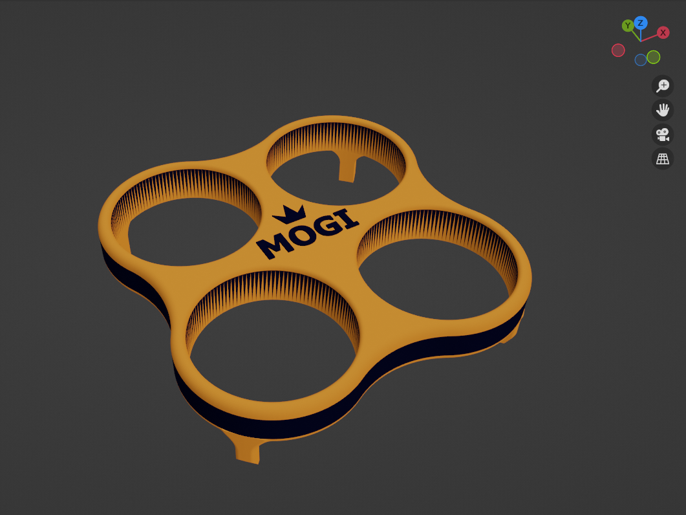
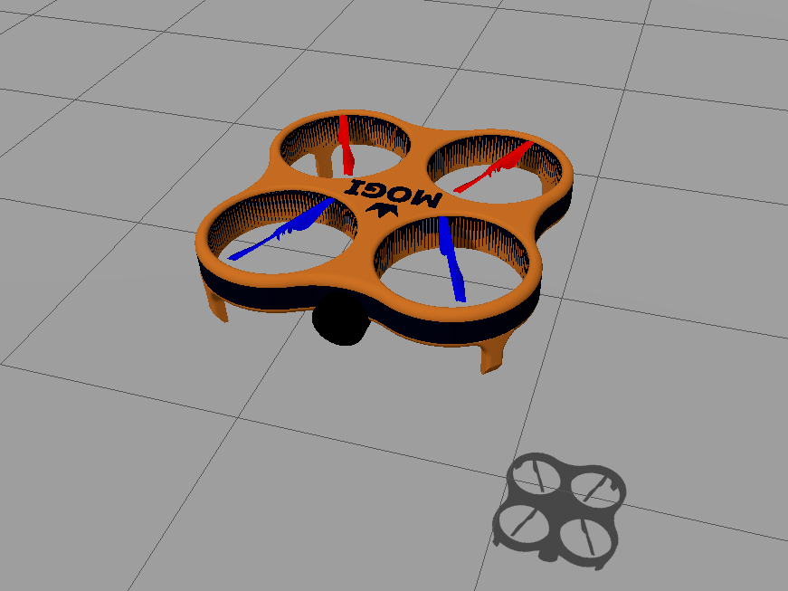

# Drone Simulation Environment, Localization and Autonomous Drone Control
### Robotics Systems Laboratory (BMEGEMINMRL) Project Documentation
### Miklós Balázs, Gergely Martin Nádas
<video controls src="docs/RoboLab_hazi_video.mp4" title="Title"></video>

## Table of Contents

1. [Install and Setup](#install-and-setup)
   - [Prerequisites](#prerequisites)
   - [Clone the Repository](#clone-the-repository)
2. [Usage](#usage)
   - [Start the Simulation](#start-the-simulation)
   - [Launch the Tele-op Node](#launch-the-tele-op-node)
3. [Drone Model](#drone-model)
   - [Mesh](#mesh)
   - [URDF](#urdf)
     - [Structure](#structure)
     - [Sensors](#sensors)
     - [Extensions & Xacro Templates](#extensions--xacro-templates)
4. [Gazebo Plugins & Sensor Configuration](#gazebo-plugins--sensor-configuration)
   - [MulticopterMotorModel Plugin](#multicoptermotormodel-plugin)
   - [Control – VelocityControl Plugin](#control--velocitycontrol-plugin)
   - [Sensors](#sensors-1)
     - [Camera](#camera)
     - [IMU](#imu)
     - [GPS (NavSat)](#gps-navsat)
   - [World & Geodetic Settings](#world--geodetic-settings)
   - [Additional Plugins](#additional-plugins)
5. [Localisation System](#localisation-system)
   - [Kalman Filter (EKF)](#kalman-filter-ekf)
   - [GPS → NavSat Transform](#gps--navsat-transform)
   - [Visualisation & Tuning – Trajectory Server](#visualisation--tuning--trajectory-server)
6. [Simulation](#simulation)
   - [Drone Control](#drone-control)
     - [teleop_drone Node](#teleop_drone-node)
     - [drone_way_home Node](#drone_way_home-node)
7. [Licence](#licence)

## Install and Setup

### Prerequisites
* **ROS 2 Jazzy** desktop  
* **Gazebo Harmonic**  
* `mogi_trajectory_server` package:
```bash
git clone https://github.com/MOGI-ROS/mogi_trajectory_server
```
* Python dependency:
```bash
pip install tf-transformations
```


### Clone the Repository

You can clone the repo to your workspace:

```bash
git clone https://github.com/nadasmartin/drone_basic_py.git
```

And don't forget to build and source:

```bash
colcon build

source install/setup.bash
```
---

## Usage
### Start the Simulation
```bash
ros2 launch drone_basic_py spawn_robot.launch.py
```
This launch file starts Gazebo, spawns the drone into the default `home.sdf` world, runs RViz 2 and brings up all nodes required for localization and automatic return-to-home.

### Launch the Tele-op Node
```bash
ros2 run drone_basic_py teleop_drone
```
The customised **Tele-op** node (forked from [`teleop_twist_keyboard`](https://index.ros.org/p/teleop_twist_keyboard/)) lets you control the drone with the keyboard via the `drone/cmd_vel` topic.

---

# Drone Model

## Mesh
We modelled a simple quad-rotor frame in Autodesk Inventor, textured it in Blender, and exported the final `.dae` mesh that is referenced from the URDF.



## URDF
The URDF defines the frame, the four rotors and all sensors (camera, IMU, GPS).



### Structure
* **Body (`base_link`)** – lightweight box with realistic mass & inertia; visual uses the exported mesh.  
* **Rotors** – links `rotor_0`…`rotor_3`, each attached through a `continuous` joint; colour-coded (red/blue) and configured for alternating CW/CCW spin.

### Sensors
* **Camera** – forward-facing RGB camera (`camera_link` & `camera_link_optical`).  
* **IMU** – 100 Hz IMU at `imu_link`.  
* **GPS** – NavSat link `navsat_link`.

### Extensions & Xacro Templates
* `materials.xacro` – custom colours/materials.  
* `drone_custom.gazebo` – Gazebo-specific plugins and settings.


---

# Gazebo Plugins & Sensor Configuration

For the Gazebo simulation the drone model is augmented with several plugins and sensor definitions.  
These guarantee realistic physics while enabling autonomous control and reliable localisation.

## MulticopterMotorModel plugin


Each of the four rotors has its own `MulticopterMotorModel` plugin, simulating rotor physics:

- Direction of rotation (CW / CCW), spin-up / spin-down time-constants and maximum RPM are set.  
- Thrust and torque coefficients, plus drag and rolling-moment parameters, are tuned for each rotor.  
- Every rotor has its dedicated `motorSpeedPubTopic`.

## Control – VelocityControl plugin

The `MulticopterVelocityControl` plugin provides the high-level autopilot:

- Receives linear and angular velocity commands on the `drone/cmd_vel` topic.  
- Performs three cascaded loops: velocity → attitude → rate control.

## Sensors

### Camera

- Forward-facing camera delivering 640 × 480 RGB images.  
- A mild Gaussian noise model is enabled for realism.  
- Publishes on `camera/image` and `camera/camera_info`.

### IMU

- 100 Hz inertial unit mounted at the centre of the frame.  
- Provides realistic acceleration and angular-rate data.  
- Publishes on `imu`.

### GPS (NavSat)

- 1 Hz GPS receiver attached to the airframe.  
- Supplies the global WGS-84 position.  
- Publishes on `navsat`.

## World & Geodetic Settings

- World origin fixed at Budapest Ferenc Liszt International Airport (LHBP)  
  - **Latitude:** `47.438998°`  
  - **Longitude:** `19.268083°`  
  - **Altitude:** `0 m`  
- ENU (East-North-Up) orientation.

## Additional Plugins

- **OdometryPublisher** – streams ground-truth pose on `drone/odom_ground_truth`, useful for evaluating localisation accuracy.  
- **JointStatePublisher** – publishes rotor joint states on `joint_states`.

## Localisation System

Accurate pose estimation is provided by the **robot_localization** package, fusing IMU and GPS.

### Kalman Filter (EKF)

The `ekf_node` runs an **Extended Kalman Filter**:

- Configured via `ekf.yaml`.  
- Inputs: IMU (`imu`) and GPS-based odometry (`odometry/gps`).  
- Output: filtered state on `odometry/filtered`.

### GPS → NavSat Transform

`navsat_transform_node` converts GPS fixes to the local frame:

- Parameters in `navsat_transformation.yaml`.  
- Reads IMU from `imu`, raw GPS from `navsat`.  
- Publishes `odometry/gps` and `gps/filtered`.

### Visualisation & Tuning – Trajectory Server

Fine-tuning was done in **RViz** with the **mogi_trajectory_server** package:

- `mogi_trajectory_server` logs the filtered trajectory in the `odom_estimate` frame.  
- `mogi_trajectory_server_topic_based` displays Gazebo ground truth on `trajectory_ground_truth`.

This lets us compare EKF output (green) to ground truth (red) and adjust filter parameters precisely.

<video controls src="docs/20250517-1517-47.6764496.mp4" title="Title"></video>


## Simulation

Start the simulation with the command shown earlier:

```bash
ros2 launch drone_basic_py spawn_robot.launch.py
```

The launch file boots up Gazebo, loads the drone into the default `home.sdf` world, launches RViz 2, and starts every node needed for localisation and the automatic return-to-home routine.

The `home.sdf` environment is taken from: https://github.com/MOGI-ROS/Week-3-4-Gazebo-basics

### Drone Control

#### teleop_drone node
```bash
ros2 run drone_basic_py teleop_drone
```

This customised tele-operation node is based on [teleop_twist_keyboard] (https://index.ros.org/p/teleop_twist_keyboard/) and lets you send commands to `drone/cmd_vel` with the keyboard:

```
---------------------------
Moving around:
   u    i    o
   j    k    l
   m    ,    .

For Holonomic mode (strafing), hold down the shift key:
---------------------------
   U    I    O
   J    K    L
   M    <    >

t : up (+z)
b : down (-z)
h : go home
[1-5] : save / go to waypoints

anything else : stop

q/z : increase/decrease max speeds by 10%
w/x : increase/decrease only linear speed by 10%
e/c : increase/decrease only angular speed by 10%

CTRL-C to quit

```

Alongside basic manual control we added three extra commands: `go home`, `save waypoint` and `go to waypoint`. They are triggered with `h` and the number keys `1`–`5` and are published on the `drone/waypoint` topic.

Their execution is handled by the `drone_way_home.py` node, which is started automatically by `spawn_robot.launch.py`.

#### drone_way_home node

The node listens to `odometry/filtered`, saves the very first pose as the home position, and can store up to five waypoints sent on `drone/waypoint` (keys `1`–`5`).
If a key is pressed again and a pose already exists in that slot, the drone begins navigating to it.

##### Finding home / waypoint

If the drone is below the `takeoff_height` parameter (default 3 m), it first climbs to that altitude.

It then flies laterally to the saved X-Y coordinates using PD control.

Finally, it lands when executing home, or descends to the waypoint’s Z altitude when executing a waypoint command.

---

## Licence

This project is released under the Apache License 2.0. See the LICENCE file for details.
