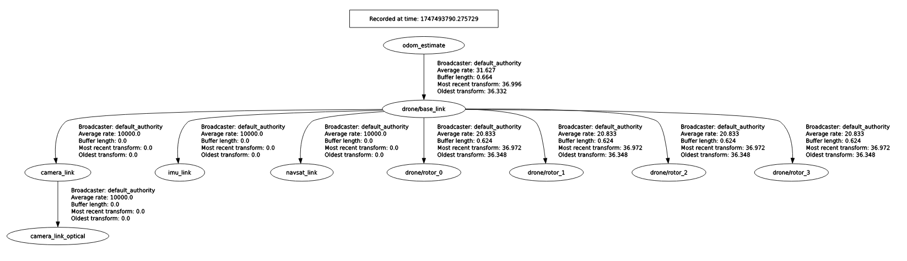
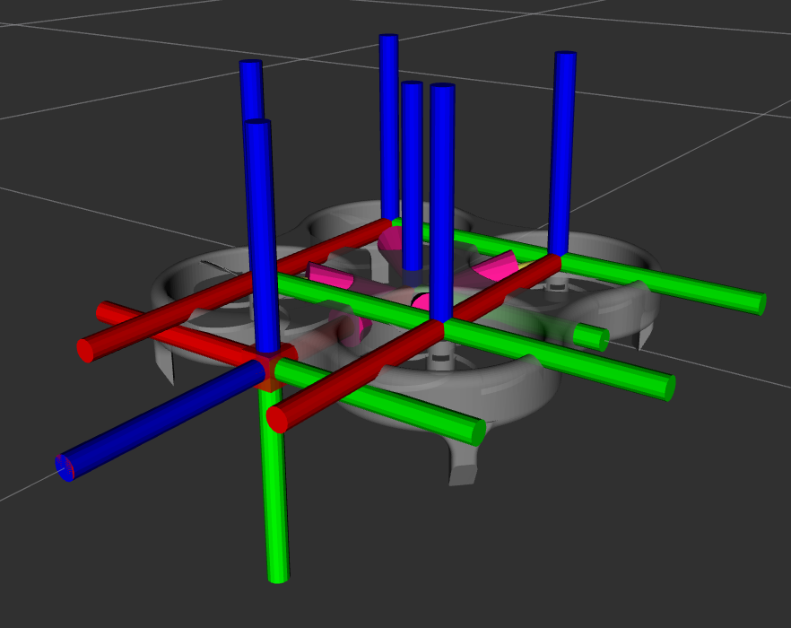

# Drón szimulációs környezet készítése, lokalizáció és autonóm drónirnyítás fejlesztése
### Robotrendszerek laboratórium(BMEGEMINMRL) házi feladat dokumentáció
### Balázs Miklós, Nádas Gergely Maritn
<video controls src="docs/RoboLab_hazi_video.mp4" title="Title"></video>
## Usage
Szimuláció indítása:
```
ros2 launch drone_basic_py spawn_robot.launch.py
```
Általunk kibővített Teleop node indítása, a drón irányításához:
```
ros2 run drone_basic_py teleop_drone
```
# Gazebo-s környezet
## Drone modell
### Drone Mesh
Ide majd írd le, amit gondolsz Miki.
### Drone URDF

A projekt során egy egyszerű, négymotoros kvadkopter URDF modellt készítettünk. A modell tartalmazza a drón törzsét, rotorjait, valamint az autonóm működéshez szükséges szenzorokat (kamera, IMU, GPS).

#### Szerkezeti felépítés

- **Törzs (`base_link`)**
  - Egy könnyű doboz testet definiáltunk, amelyhez a rotorok és szenzorok kapcsolódnak.
  - A törzshöz valósághű tömeg- és tehetetlenségi paramétereket rendeltünk.
  - Megjelenéséhez egy `.dae` formátumú 3D mesh modellt használtunk.

- **Rotorok**
  - Négy rotor található a modellen: `rotor_0`, `rotor_1`, `rotor_2`, `rotor_3`.
  - Mindegyik rotor külön linként szerepel, és egy-egy folyamatos (`continuous`) típusú csuklóval (`joint`) csatlakozik a törzshöz.
  - A rotorokat eltérő színekkel jelöltük (piros és kék), valamint eltérő irányú forgással (CW és CCW) modelleztük.

#### Szenzorok

- **Kamera**
  - Előre néző kamerát helyeztünk el a drón elején (`camera_link` és `camera_link_optical`).
  - A kamera fix csuklóval csatlakozik a törzshöz, az optikai tengely megfelelő tájolásával.
  - A Gazebo szimulációban piros színnel jelenik meg.

- **IMU**
  - Az IMU-t a `imu_link` elem képviseli, amelyet fixen rögzítettünk a törzshöz.
  - A későbbi szenzor plugin integrációkhoz megfelelő alapot biztosít.

- **GPS**
  - A `navsat_link` szintén egy fix csuklón keresztül kapcsolódik a törzshöz.
  - A lokalizációhoz szükséges.

#### Kiterjesztések és sablonok

- A modell két további `xacro` sablont használ:
  - `materials.xacro` – az egyedi anyagok és színek definiálásához.
  - `drone_custom.gazebo` – Gazebo pluginok és szimulációspecifikus beállítások hozzáadásához.

  
  
 

## Gazebo bővítmények és szenzorbeállítások

A Gazebo szimulációhoz a drónmodellünkhöz több, funkcionalitást biztosító plugin-t és szenzor konfigurációt integráltunk. Ezek biztosítják a fizikai szimuláció realisztikus viselkedését, valamint lehetővé teszik az autonóm vezérlést és a lokalizációt.

### MulticopterMotorModel plugin

Mind a négy rotorhoz külön `MulticopterMotorModel` plugin-t rendeltünk hozzá, amely a rotorok fizikai viselkedését modellezi:

- Beállítottuk a forgásirányt (CW/CCW), a gyorsulási/lelassulási időállandókat és a maximális fordulatszámot.
- A rotorok erő- és nyomaték-konstansait, valamint a légellenállási és gördülési momentummal kapcsolatos paramétereket is meghatároztuk.
- Minden rotorhoz külön `motorSpeedPubTopic` került hozzárendelésre.

### Vezérlés – VelocityControl plugin

A `MulticopterVelocityControl` plugin biztosítja az autonóm vezérlés lehetőségét:

- `drone/cmd_vel` topikon keresztül lineáris és szögsebesség parancsokat fogad.
- Három szinten történik a vezérlés: sebesség, dőlésszög (attitűd) és szögsebesség.

### Szenzorok

#### Kamera

- Előre néző kamera került a drónra, amely 640×480 felbontású RGB képeket szolgáltat.
- A képek enyhe Gauss-zajjal rendelkeznek a realisztikusabb szimuláció érdekében.
- A kamera `camera/image` és `camera/camera_info` topikokra publikál.

#### IMU

- 100 Hz frissítési frekvenciájú IMU került elhelyezésre a törzs középpontjában.
- A szimulációban valósághű gyorsulás- és szögsebesség-adatokat szolgáltat.
- Publikálási topik: `imu`.

#### GPS (NavSat)

- 1 Hz-es frissítési frekvenciájú GPS szenzort helyeztünk el a modellen.
- A rendszer földrajzi helyzetét biztosítja.
- Publikálási topik: `navsat`.

### Pozíció és világbeállítások

- A szimulációs világ WGS84 koordináta-rendszerben van definiálva, a Ferihegyi repülőtéren:
  - **Szélesség:** `47.438998°`
  - **Hosszúság:** `19.268083°`
  - **Tengerszint feletti magasság:** `0 m`
- Az orientáció ENU (East-North-Up) rendszerű.

### Kiegészítő plugin-ek

- **OdometryPublisher**: Publikálja a drón valós pozícióját a `drone/odom_ground_truth` topikra, lokalizáció fejlesztés során hasznos volt, hogy tudtuk mihez hasonlítani a lokalizáció aktuális képességét.
- **JointStatePublisher**: Leképezi a rotorcsuklók állapotát a `joint_states` topikra.

## Lokalizációs rendszer

A drón pozíciójának és orientációjának megbízható meghatározása érdekében a ROS 2-höz készült **robot_localization** csomagot használtuk. A rendszer az IMU és GPS adatok egyesítésével becsült pontos és szűrt állapotot biztosít a drón számára.

### Kalman-szűrő (EKF)

Az állapotszűrés alapját az `ekf_node` adja, amely egy **Extended Kalman Filter** (EKF) algoritmust futtat:

- A szűrő a `ekf.yaml` konfigurációs fájl alapján dolgozik.
- A bemeneti szenzoradatok közé tartozik az IMU (`imu`) és a GPS alapú odometria (`odometry/gps`).
- A szűrt állapot a `odometry/filtered` topikon jelenik meg.

### GPS – Navsat átalakítás

A GPS adatokat a `navsat_transform_node` dolgozza fel, amely a földrajzi koordinátákat a lokális térbe transzformálja:

- A transzformáció beállításait a `navsat_transformation.yaml` fájl tartalmazza.
- Az IMU adatokat a `imu` topikról, a nyers GPS adatokat a `navsat` topikról olvassa be.
- Kimenetként a `odometry/gps` és `gps/filtered` topikokra publikál.

### Vizualizáció és hangolás – Trajectory Server

A lokalizáció finomhangolását és vizsgálatát **RViz-ben** végeztük, a **mogi_trajectory_server** csomag segítségével. Ez lehetővé tette a becsült és a ground truth pozíciók összehasonlítását:

- A `mogi_trajectory_server` folyamatosan naplózza a szűrt pozíciót az `odom_estimate` frame-ben.
- A `mogi_trajectory_server_topic_based` komponens a Gazebo-ból érkező `drone/odom_ground_truth` topikot jeleníti meg a `trajectory_ground_truth` néven.

Ennek köszönhetően vizuálisan is nyomon tudtuk követni a lokalizáció teljesítményét, és pontosan tudtuk hangolni a szűrő paramétereit.

Az alábbi videóban a piros trajektória a ground truth és a zöld pedig a becsült.

<video controls src="docs/20250517-1517-47.6764496.mp4" title="Title"></video>

